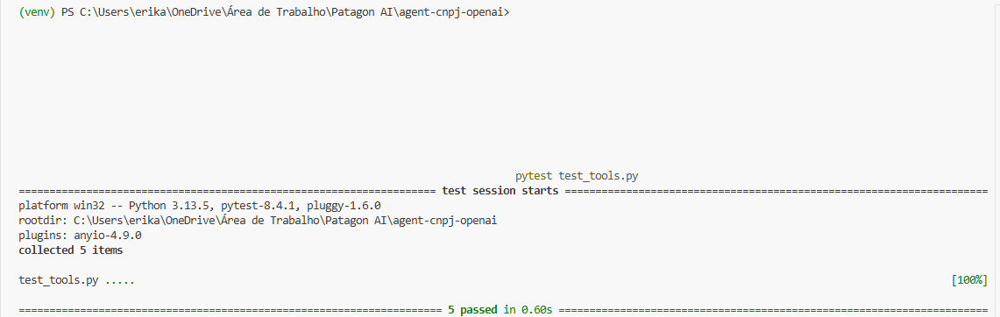
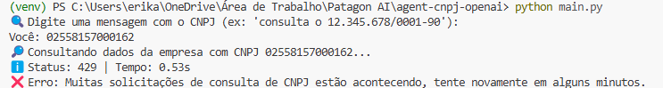

# Evidências de Teste — Agent CNPJ OpenAI

Este documento apresenta os testes realizados para validar a funcionalidade de consulta de CNPJs via API pública da CNPJá. Os testes foram conduzidos utilizando `pytest` com mocks, devido à indisponibilidade recorrente da API durante o desenvolvimento.

---

## ✅ Estrutura dos Testes

O arquivo `test_tools.py` cobre os seguintes cenários:

1. **CNPJ válido e resposta bem-sucedida**
2. **CNPJ mal formatado (erro 400)**
3. **CNPJ não encontrado (erro 404)**
4. **Rate limit excedido (erro 429)**
5. **Erro interno do provedor (erro 5xx)**

Todos os testes utilizam `unittest.mock.patch` para simular as respostas da API.

---

## 🔍 Comando executado

Para rodar os testes, foi utilizado o comando abaixo no terminal da raiz do projeto:

```bash
pytest test_tools.py


================================= test session starts =================================
platform win32 -- Python 3.13.5, pytest-8.4.1, pluggy-1.6.0
rootdir: C:\Users\erika\OneDrive\Área de Trabalho\Patagon AI\agent-cnpj-openai
plugins: anyio-4.9.0
collected 5 items

test_tools.py .....                                                       [100%]

============================= 5 passed in 0.60s =============================


Evidência do resultado



---

## ⚠️ Observação adicional

Durante todo o desenvolvimento, a API da CNPJá apresentou erros 429 (Too Many Requests), impedindo testes com CNPJs reais.

📸 Abaixo, print do agente em execução real simulando esse cenário:

